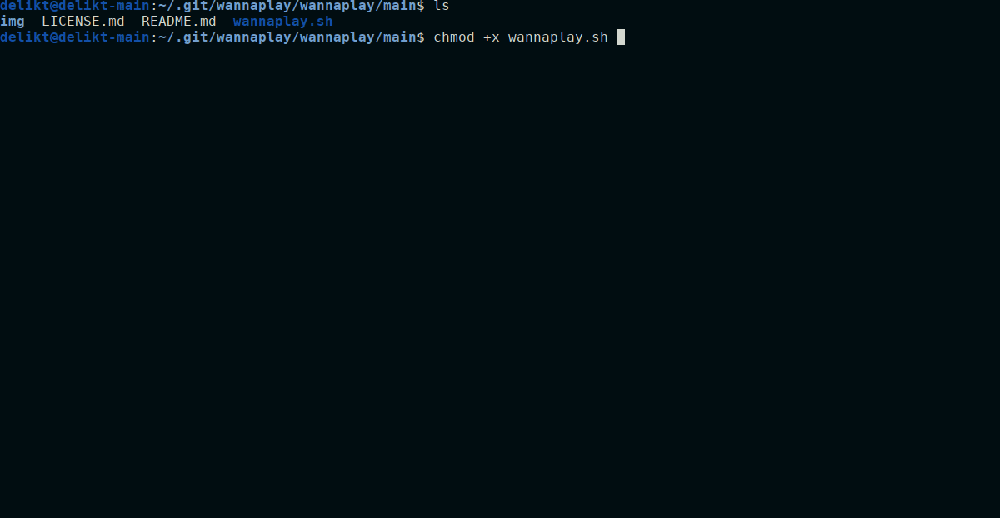
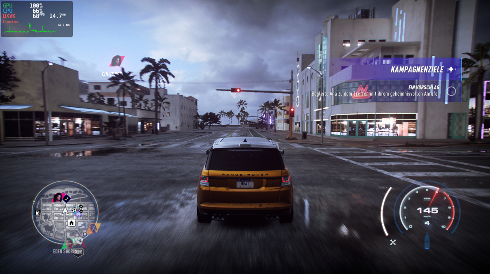
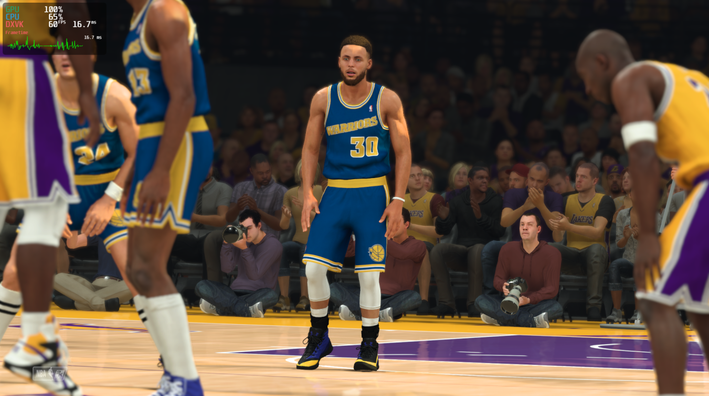
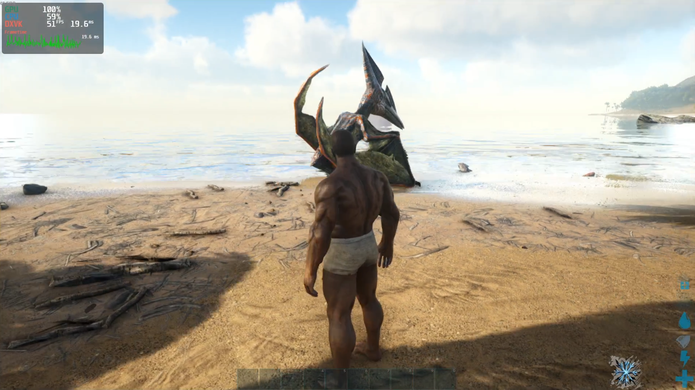

# Wanna Play a Game (on Linux)?

The **wannaplay** Script install all necessary Libraries to play "State of the Art" Windows Games on **Ubuntu 19.10+** based Distributions.

It's a half-automated Script that have the capability to play most of the latest DX11 Games like Need for Speed Heat, Battlefield V, Resident Evil 7 and 2 (Remake), Star Wars Jedi: Fallen Order, Blizzard Games, NB2K20 and many more.

For a large List of working Steam Games visit [protondb](https://www.protondb.com/).

An easy way to install many Games on Linux via Scripts, are the Lutris Gaming Plattform - visit [Lutris Homepage](https://lutris.net/). 

### What it does:

- automatically detect your Graphic Card and install the latest recommended Driver for Intel/AMD/Nvidia GPU's
- install WineHQ (staging) and Winetricks
- install Vulkan API
- Install 32-bit Game support
- install additional Libraries for better compatibility with Origin, Battle.net, Uplay etc.
- configure Esync support
- install native Steam and Lutris Gaming Plattforms
- install ProtonGE Custom Build to fix some issues in Steam Games
- install Protontricks
- install useful Software like MangoHUD (FPS Overlay), OBS Studio (Screencast Software) etc.

### Dependencies:

**dialog** (available in the official Ubuntu Repository)

**jq** (Just if ProtonGE Custom Build will be installed - available in the official Ubuntu Repository)

**build-essential** (available in the official Ubuntu Repository)

#### Notice:

This Script install the Mesa Driver Package (**Open-Source**) this Package contains **Intel** and **AMD** GPU Driver.

The Nvidia Driver is on the other Hand **fully proprietary**!.

### Usage:

1) Navigate to the Folder where the wannaplay.sh File is located -> Open your **Terminal** in this Directory.

2) Execute ``sudo chmod +x wannaplay.sh`` to give the Script execution rights.

3) After that execute the Script by typing: ``sudo ./wannaplay.sh``

4) Done.. follow the Script with the User input prompt and you'r should be fine so far.

### Proof of Concept: 

Need for Speed Heat (DXVK):

[NFS Video](https://www.youtube.com/watch?v=daRrBt9mkfc)

NBA2K20 (Proton):

[NBA2K20 Video](https://www.youtube.com/watch?v=YZctphzbxpU)

Ark Survival Evolved (Proton):

[Ark Video](https://www.youtube.com/watch?v=Q9ByJ51RU6w)
